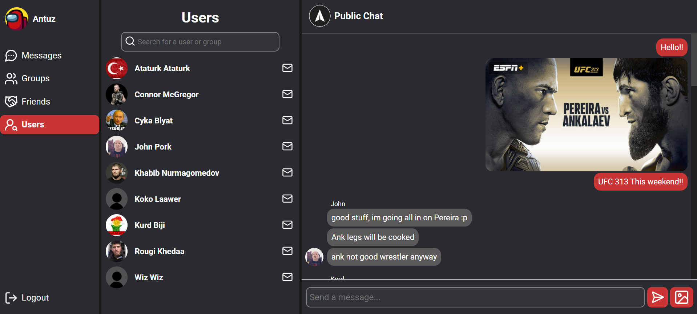
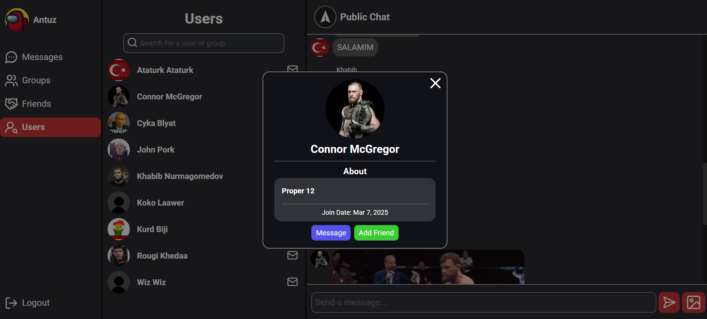

# Messenger App

A full-stack messenger application designed to provide seamless communication.



## Signup page


## User Profile



## Features

- Authentification with refresh/access cookie based jwt tokens.
- Real time messaging.
- Image sharing capability.
- Group creation and management.
- User connection and interaction.

## Technologies Used

### Frontend

- Javascript
- React
- Vite
- Vercel
- Socket.IO

### Backend

- Express
- Nodejs
- PostgreSQL
- Prisma ORM
- Socket.IO
- Cloudinary
- Koyeb
- Aiven

## 🛠️ How to Run the Project Locally

### Prerequisites

- [Node.js](https://nodejs.org/) (v16 or later recommended)
- [npm](https://www.npmjs.com/) (comes with Node.js)
- [PostgreSQL](https://www.postgresql.org/) (ensure your database is running)
- Basic knowledge of using a terminal (steps are beginner-friendly)

---

### 1. Clone the Repository

```bash
git clone https://github.com/3antozz/Messaging-app
cd Messaging-app
```

### 2. Setup the Backend (API)

```bash
cd api
npm install
```

**Create a .env file in the api/ directory (based on .env.example) and fill in the required environment variables such as:** 

* Database connection URL
* JWT secrets
* Cloudinary credentials

Start the backend server:

```bash
npm start
```
> [!NOTE]
> The backend will run on http://localhost:3000 by default.

### 3. Setup the Frontend (Client)

Open a new terminal window or tab:
```bash
cd client
npm install
npm run dev
```
**Rename the .env.example file to .env in the client/ directory**

> [!NOTE]
> The frontend will run on http://localhost:5173 by default.

### 4. Open in Browser

1- Once both servers are running:

2- Visit http://localhost:5173 in your browser


## Libraries Used

### Frontend

- [Lucide React](https://lucide.dev/guide/packages/lucide-react) – Import Icons.
- [react-intersection-observer](https://www.npmjs.com/package/react-intersection-observer) – React implementation of the Intersection Observer API to render messages when visible on scroll.
- [Socket.IO](https://socket.io/) – Low-latency, bidirectional and event-based communication between a client and a server for real time updates.
- [date-fns](https://date-fns.org/docs/Getting-Started) – Used for manipulating JavaScript dates.

### Backend

- [bcryptjs](https://www.npmjs.com/package/bcryptjs) – For securing passwords by hashing and salting.
- [jsonwebtoken](https://www.npmjs.com/package/jsonwebtoken) – Implementation of JSON Web Token for signing tokens and authenticating users.
- [express-validator](https://www.npmjs.com/package/express-validator) – User input validation middleware.
- [cloudinary](https://cloudinary.com/) – Images storage service.
- [multer](https://www.npmjs.com/package/multer) – Node.js middleware for handling multipart/form-data, used for uploading files.
- [express-async-handler](https://www.npmjs.com/package/express-async-handler) – Asynchronous exception-handling middleware.
- [Socket.IO](https://socket.io/) – Low-latency, bidirectional and event-based communication between a client and a server for real time updates.
- [date-fns](https://date-fns.org/docs/Getting-Started) – Used for manipulating JavaScript dates.
- [cors](https://www.npmjs.com/package/cors) – Package for providing a Connect/Express middleware that can be used to enable CORS.
- [cookie-parser](https://www.npmjs.com/package/cookie-parser) – Used to parse Cookies.
