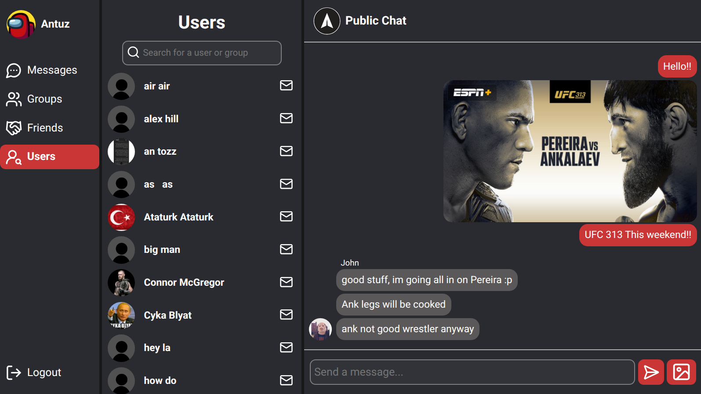

# Messenger App

A full-stack messenger application designed to provide seamless communication.

## Signup page

## User Profile

## Features

- Authentification with refresh/access cookie based jwt tokens
- Real time messaging
- Image sharing capabilities
- Group creation and management
- User connection and interaction

## Technologies Used

### Frontend

- Javascript
- React
- Vite
- Vercel
- Socket.IO

### Backend

- Express
- Nodejs
- PostgreSQL
- Prisma ORM
- Socket.IO
- Cloudinary
- Koyeb
- Aiven

## Libraries Used

### Frontend

- [Lucide React](https://lucide.dev/guide/packages/lucide-react) – Import Icons
- [react-intersection-observer](https://www.npmjs.com/package/react-intersection-observer) – React implementation of the Intersection Observer API to render messages when visible on scroll
- [Socket.IO](https://socket.io/) – Low-latency, bidirectional and event-based communication between a client and a server for real time updates

### Backend

- [bcryptjs](https://www.npmjs.com/package/bcryptjs) – For securing passwords by hashing and salting.
- [jsonwebtoken](https://www.npmjs.com/package/jsonwebtoken) – Implementation of JSON Web Token for signing tokens and authenticating users
- [express-validator](https://www.npmjs.com/package/express-validator) – User input validation middleware.
- [cloudinary](https://cloudinary.com/) – Images storage service
- [multer](https://www.npmjs.com/package/multer) – Node.js middleware for handling multipart/form-data, used for uploading files.
- [express-async-handler](https://www.npmjs.com/package/express-async-handler) – Asynchronous exception-handling middleware.
- [Socket.IO](https://socket.io/) – Low-latency, bidirectional and event-based communication between a client and a server for real time updates
- [date-fns](https://date-fns.org/docs/Getting-Started) – Used for manipulating JavaScript dates
- [cors](https://www.npmjs.com/package/cors) – Package for providing a Connect/Express middleware that can be used to enable CORS
- [cookie-parser](https://www.npmjs.com/package/cookie-parser) – Used to parse Cookies
